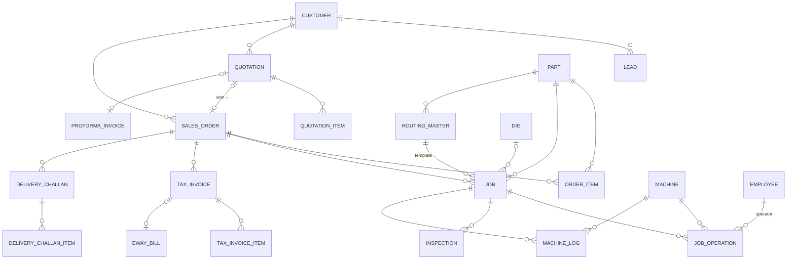
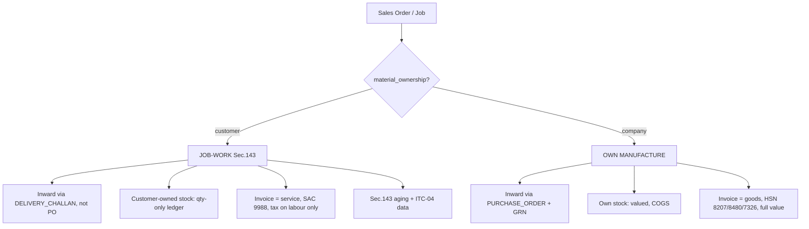

# 02 · Data Model & ERD

The database schema. Grounded in how a Faridabad die/tool + machining job-shop actually operates and in India GST/e-invoice/job-work law. **~70 tables across 11 domains.** This doc gives the ERD for the core spine, then a table-by-table reference (purpose + notable fields; spine tables in full).

> Read `01-architecture.md` first for the storage conventions this builds on.

---

## 0. Conventions (recap + additions)

- **Every business table** carries `tenant_id uuid not null` and is protected by **Postgres RLS**; plus `id uuid pk`, `created_at`, `updated_at`, `created_by`, `updated_by`, and `deleted_at` (soft delete) where useful.
- **Money** = `numeric(14,2)`; tax computed per line, rounded per invoice per GST rules.
- **Enums** shown as `{a|b|c}` — Postgres enums or lookup tables.
- **Document numbers** issued gap-free per (tenant, doc_type, financial year) via `doc_sequence` (`INV/26-27/0001`).
- **⚠️ Two decisions that shape everything** (from the domain research), applied throughout:
  1. **Versioned parameter tables** — every notification-driven number (GST rate, e-invoice/e-way thresholds, HSN digit rule, PF/ESI ceilings, minimum wages) lives in a table with `effective_from`/`effective_to`, **never** a code constant. Old documents keep validating against the rules in force on their date.
  2. **`material_ownership {customer|company}`** on the order/job — the **single highest-leverage flag**. It branches invoice type (SAC 9988 service invoice vs. goods-HSN tax invoice), inventory valuation, goods-movement document (delivery challan vs. tax invoice), and ITC-04/Sec-143 aging.

---

## 1. Core ERD — the sales-to-cash + production spine

The **`JOB` → `JOB_OPERATION`** pair is the **route card / job traveller** — the spine that shop-floor tracking, machine utilization, quality, and job-costing all hang off. `ROUTING_MASTER` is the reusable per-part template a job is instantiated from.

## 2. The job-work vs. own-manufacture branch

This one flag drives four downstream behaviours — encoded so the UI and GST engine both read it:

---

## 3. Domain A — Platform & security

| Table | Purpose / notable fields |
|---|---|
| `tenant` | The factory. `name`, `legal_name`, `subdomain`, `status`, `financial_year_start`, `settings jsonb` (branding, logo, locale, enabled modules/feature-flags, default margins/rates). |
| `branch` | A GSTIN/location under a tenant. `name`, **`gstin`**, `state_code`, `address`, `is_default`. GST intra/inter-state logic compares **this branch's `state_code`** (Haryana = **06**) vs. the buyer's. |
| `user` | `name`, `email`, `password_hash` (Argon2id), `phone`, `status`, `locale {en|hi}`, `last_login_at`. Belongs to one tenant. |
| `role` | `name`, `is_system`. Tenant-customizable (defaults in `03-modules-and-rbac.md`). |
| `permission` | Global catalog of `resource.action` keys. |
| `role_permission`, `user_role` | Join tables. |
| `doc_sequence` | `(tenant_id, doc_type, financial_year)` → `prefix`, `format`, `next_number`. Gap-free, transactional. |
| `audit_log` | `entity_type`, `entity_id`, `action`, `before jsonb`, `after jsonb`, `ip`, `at`. Written for sensitive entities. |
| `notification` | `user_id`, `type`, `title`, `body`, `entity_ref`, `read_at`. Feeds realtime + reminders (quote follow-up, payment due, Sec-143 aging). |
| `attachment` | MinIO refs for drawings/PDFs/CAD: `entity_type`, `entity_id`, `file_key`, `filename`, `mime`, `size`, **`version`**, `uploaded_by`. Versioned. |
| `ai_usage` | `user_id`, `feature`, `model`, `input_tokens`, `output_tokens`, `cost`, `at`. Per-tenant AI metering/budgets. |

## 4. Domain B — Parameters & masters (⚠️ versioned)

| Table | Purpose / notable fields |
|---|---|
| `param_gst_rate` | `hsn_sac`, `description`, `rate`, `effective_from/to`. GST 2.0 default **18%** for engineering job-work & tooling. |
| `param_compliance` | Keyed values: `einvoice_threshold` (₹5cr — **verify; a ₹2cr claim is unconfirmed**), `eway_threshold` (₹50k), `hsn_digit_cutoff`, `pf_ceiling`, `esi_ceiling`, all with `effective_from/to`. |
| `param_min_wage` | `skill_category {unskilled|semi|skilled|highly}`, `monthly`, `daily`, `effective_from/to` (Haryana revises ~2×/yr). |
| `hsn_sac_master` | `code`, `description`, `type {HSN|SAC}`, `default_gst_rate`. Store full 6–8 digit; truncate to 4 at print if tenant turnover < ₹5cr. |
| `uqc_master` | Unit codes: `NOS`, `KGS`, `MTR`, `SET`, `PCS`, `TON`, `SQM`, `LTR`… |
| `shift` | `code`, `name`, `start_time`, `end_time`, `break_minutes`, `ot_threshold_daily` (9h). |
| `holiday_calendar` | `date`, `name`, `year`. Haryana-notified. |
| `leave_type` | `code {CL|SL|EL|LWP|COMP}`, `name`, `paid`. |
| `downtime_reason` | `code`, `description`, `owner_function`. Seeded 16-code flat list (breakdown, tool-change, no-material, setup, PM…). |
| `reject_reason` | Reason codes for scrap/rework at an operation. |

## 5. Domain C — CRM & Sales

| Table | Purpose / notable fields |
|---|---|
| `lead` | `source`, `customer_name`, `contact`, `phone`, `email`, `requirement`, `stage {new|contacted|negotiation|won|lost}`, `owner_user_id`, `value_estimate`, `next_followup_at`, `converted_customer_id`. |
| `lead_activity` | `lead_id`, `type {call|email|meeting|note}`, `notes`, `at`, `by_user`. Follow-up trail. |
| `customer` | `code`, `name`, **`gstin`**, `reg_type {registered|unregistered}`, `state_code`, `contact_person`, `phone`, `email`, `credit_terms_days`, `credit_limit`, `status`. |
| `customer_address` | `type {billing|shipping}`, `line`, `city`, `state`, `state_code`, `pincode`. Bill-to state drives CGST/SGST vs IGST. |
| `part` | Part/product master: `part_no`, `name`, `drawing_no`, `drawing_rev`, `material_grade`, `hsn_code`, `uom`, `customer_id?`, `category {die|mould|component|tool|fixture|sole_mould}`. Drawings via `attachment`. |
| `quotation` | `number`, `date`, `validity_date`, `customer_id`, `customer_rfq_ref`, `status {draft|sent|negotiation|won|lost}`, `subtotal`, `tax_total`, `grand_total`, `terms`, `tooling_ownership_clause`, `prepared_by`. |
| `quotation_item` | `part_id?`, `description`, `drawing_ref`, `material`, `hsn_code`, `qty`, `uom`, `rate`, `taxable_value`, `gst_rate`, **`is_tooling_charge`** (splits one-time die/NRE cost from per-piece running rate). |
| `quotation_costing` | AI-assisted price build-up (see `05`): `material_cost`, `machining_cost`, `tooling_cost`, `overhead`, `margin`, `assumptions jsonb`. Auditable, editable. |
| `proforma_invoice` + `_item` | Advance-request document. Own number series (`PI/…`), `bank_details`, `validity_date`. Clearly **not a tax invoice**; never in GSTR-1. |

## 6. Domain D — Orders & Production (the spine, full detail)

**`sales_order`** — `number`, `date`, `customer_id`, `quotation_id?`, `po_ref`, `po_date`, **`order_category {job_work|own_manufacture|tool_build|repair}`**, **`material_ownership {customer|company}`**, `delivery_date`, `priority`, `status {open|in_production|partially_dispatched|completed|closed|hold}`, `total_value`.

**`order_item`** — `part_id`, `description`, `qty`, `uom`, `rate`, `delivery_date`, `produced_qty`, `dispatched_qty`, `status`.

**`order_milestone`** — for **milestone billing** on tool builds: `name {advance|on_trial|on_delivery}`, `percent`, `amount`, `condition`, `invoiced bool`.

**`routing_master`** / **`routing_operation`** — reusable per-part routing template: `seq`, `operation`, `machine_type`, `setup_time_min`, `cycle_time_min`, `inspection_required`. Repeat jobs instantiate from here.

**`job`** *(route-card header = work order)* — `job_no`, `order_id`, `order_item_id`, `part_id`, `die_id?`, `routing_id?`, `customer_id`, `qty`, `priority`, `material_grade`, **`material_source {customer|company}`**, `heat_batch_no`, `raw_size`, `planned_start`, `due_date`, `status {open|in_process|hold|completed|dispatched}`, `planner_user_id`, `total_planned_time`, `special_instructions`.

**`job_operation`** *(route-card lines — the shop-floor heartbeat)*:
`seq`, `operation`, `machine_id`, `program_ref`, `fixture_ref`, `planned_setup_min`, `planned_cycle_min`, `planned_total`, `operator_id`, `actual_setup_min`, `actual_run_min`, `time_in`, `time_out`, `qty_received`, `qty_produced`, `qty_rejected`, `reject_reason_id`, `qty_reworked`, `inspection_required`, `inspector_id`, `qc_status {pending|passed|failed|hold}`, `shift`, `downtime_min`, `downtime_reason_id`, `supervisor_signoff`. **Sequencing gates** (rough→stress-relieve→harden→finish-grind→assembly→trial→FAI→dispatch) enforced in status transitions.

**`job_material_issue`** — `material_desc`, `qty`, `uom`, `heat_batch`, `issued_at`, `issued_by`. Batch traceability to the floor.

## 7. Domain E — Die Management

| Table | Purpose / notable fields |
|---|---|
| `die` | `die_no`, `name`, `type {press_tool|mould|forging_die|jig|fixture|sole_mould}`, `customer_id?`, **`owner {customer|company}`**, `part_id`, `status {in_development|active|under_maintenance|idle|retired}`, `location`, `press_tonnage`, `no_of_stations`, `hardness_target`, `current_hit_count`, `max_hit_life`. Sec-143 excludes dies/moulds from the return time-limit — the `owner` flag matters. |
| `die_event` | Lifecycle log: `type {created|trial|maintenance|repair|relocated|retired|production_run}`, `date`, `details`, `hits_added`, `by_user`. |
| `die_maintenance` | `scheduled_date`, `done_date`, `type`, `description`, `cost`, `downtime`, `by_user`. Preventive + breakdown. |

## 8. Domain F — Machines & Tooling

| Table | Purpose / notable fields |
|---|---|
| `machine` | `code`, `name`, `type {vmc|cnc_lathe|wire_edm|sinker_edm|surface_grinder|radial_drill|lathe|mill|cyl_grinder|jig_borer}`, `make_model`, `control_system`, `work_envelope`, `spindle_capacity`, **`hourly_rate`** (quotation costing), `status {running|idle|breakdown|maintenance|scrapped}`, `department`. |
| `machine_log` | **Event-based utilization** (same shape as attendance): `machine_id`, `date`, `shift`, `operator_id`, `job_id?`, `job_operation_id?`, `state {setup|run|idle|breakdown|planned_maintenance}`, `state_start`, `state_end`, `duration_min`, `downtime_reason_id?`, `qty_produced`, `planned_available_min`, `entry_source {manual|auto}`. Utilization %, setup %, OEE-lite, and job-costing tie-back are **computed**, not stored. |
| `tool` | Crib master: `code/barcode`, `type {insert|drill|tap|reamer|endmill|edm_electrode|edm_wire|grinding_wheel|boring_bar|collet|gauge}`, `iso_designation`, `material_grade`, `coating`, `supplier_id`, `unit_cost`, `expected_life`, `life_consumed`, `regrind_count`, `max_regrinds`, `status {in_crib|issued|in_use|under_regrind|scrapped|broken}`, `location`, `reorder_level`, `stock_qty`, `program_ref`, `offset_no`, `specifics jsonb` (wire dia, wheel grit, gauge calibration-due…). |
| `tool_transaction` | `tool_id`, `type {issue|return|regrind_send|regrind_receive|scrap|purchase_receipt}`, `date`, `job_id`, `machine_id`, `operator_id`, `qty`, `life_reading`, `condition_on_return`. |
| `consumable` | Bulk (coolant, dielectric, PPE): `code`, `description`, `uom`, `stock_qty`, `reorder_level`, `consumption_rate`, `cost_center`. |

## 9. Domain G — Materials & Inventory

| Table | Purpose / notable fields |
|---|---|
| `supplier` | `code`, `name`, `gstin`, `state_code`, `contact`, `payment_terms`, `status`. |
| `purchase_indent` + `_item` | Internal requisition → `item_desc`, `material_grade`, `qty`, `required_date`. |
| `purchase_order` + `_item` | `number`, `supplier_id`, `branch_id`, `status {open|partial|received|closed}`, item `hsn_code`, `rate`, `gst_rate`, `received_qty`. |
| `grn` + `_item` | Goods receipt against **PO or customer challan**: `source {po|customer_challan}`, `challan_ref?`, `heat_batch`, `qc_result`. |
| `inventory_item` | `code`, `category {raw_material|tooling|consumable|finished|customer_owned}`, `uom`, `current_stock`, `unit_cost`, `reorder_level`, `location`, **`owner {company|customer}`**, `customer_id?`. |
| `stock_ledger` | Movements: `txn_type {grn|issue|return|adjust|dispatch}`, `qty_in`, `qty_out`, `balance`, `ref_type`, `ref_id`, `heat_batch`. **Customer-owned material = qty-only memo ledger** (non-valued), kept separate from valued own stock. |

## 10. Domain H — Quality

| Table | Purpose / notable fields |
|---|---|
| `inspection` | `ref {job_operation|grn|job}`, `type {incoming|in_process|final|fai}`, `result {pass|fail|conditional}`, `inspector_id`, `qty_checked`, `qty_passed`, `qty_rejected`. |
| `inspection_dimension` | Dimensional record: `parameter`, `nominal`, `tolerance`, `actual`, `result` (calipers/height-gauge/CMM). |
| `ncr` | Non-conformance/rework: `ref_job_id`, `description`, `disposition {rework|scrap|use_as_is|return}`, `raised_by`, `closed_by`, `status`. |

## 11. Domain I — Finance & GST compliance (full detail)

**`delivery_challan`** *(Rule 55 — goods movement without a sale)* — `number` (own `DC/…` series), `date`, `customer_id`, **`purpose {job_work_out|job_work_return|line_sales|exhibition|own_use|sale_on_approval}`**, `linked_job_id?`, `from_branch_id`, `to_address`, `transporter`, `vehicle_no`, **`declared_value`** (not a taxable value — no tax event), `eway_bill_no?`, `status`. + `delivery_challan_item` (`part_id`, `description`, `hsn_code`, `qty`, `uom`, `declared_value`).

**`tax_invoice`** *(Rule 46 — all 30+ statutory fields)* — `number` (≤16 chars, gap-free per FY), `date`, **`type {tax_invoice|job_work_service}`**, `customer_id`, `branch_id`, `order_id?`, `po_ref`, `place_of_supply`, `place_of_supply_state_code`, **`is_interstate`**, `reverse_charge bool`, `subtotal`, `cgst`, `sgst`, `igst`, `cess`, `round_off`, `grand_total`, `amount_in_words`, **`irn`, `ack_no`, `ack_date`, `signed_qr`** (nullable — e-invoice-ready from day 1), `eway_bill_no?`, `template_id`, `status {draft|issued|cancelled|paid}`.

**`tax_invoice_item`** — `part_id?`, `description`, **`hsn_sac`**, `qty`, `uom`, `rate`, `discount`, `taxable_value`, `gst_rate`, `cgst_amt`, `sgst_amt`, `igst_amt`, `cess_amt`. (Job-work service line uses **SAC 9988**; goods use HSN **8207/8480/8466/7326**.)

**`eway_bill`** — `ref {invoice|challan}`, `ewb_no`, `part_a jsonb`, `part_b jsonb` (vehicle, transporter, distance), `valid_until`, `status`. Required >₹50k **even for job-work challans** (value = declared value, not zero).

**`payment_receipt`** — light receivables: `customer_id`, `invoice_id?`, `amount`, `mode`, `ref`, `date`.

**ITC-04 / Sec-143 aging** — a **view** over `delivery_challan` (job-work legs) computing the 1-year (inputs) / 3-year (capital goods) / no-limit (dies-moulds-jigs-fixtures) clock, flagging items nearing deemed-supply. Relevant when MS Enterprises **sub-contracts** an operation (e.g. sends a customer's part out for HT/plating).

**Document templates** — `document_template` (`doc_type {quotation|proforma|tax_invoice|delivery_challan|job_challan}`, `name`, `html`, `is_default`, `version`) drives the custom-template PDF engine (`01` §9, `05` §4). Rendered PDFs stored via `attachment`.

## 12. Domain J — People (HR & Payroll)

| Table | Purpose / notable fields |
|---|---|
| `employee` | `code`, `name`, `father_name`, `designation`, `department`, **`skill_category`** (drives min-wage), `doj`, `dob`, `phone`, `status`, `wage_type {monthly|daily|piece}`, `basic`, `da`, `hra`, `allowances jsonb`, `pf_applicable`, `esi_applicable`, `uan`, `esic_no`, `bank_details`. Doubles as shop-floor `operator`. |
| `attendance` | Same event shape as `machine_log`: `employee_id`, `date`, `shift_id`, `status {present|absent|half_day|weekoff|holiday|leave}`, `punch_in`, `punch_out`, `hours_worked`, `late_min`, `early_min`, `ot_hours`, `leave_type_id?`, `source {biometric|mobile|manual}`, **`regularized`** + `reason` + `approved_by` (audited correction workflow), `job_id?` (labour-hour job costing). |
| `payroll_run` | `month`, `year`, `status {draft|finalized|paid}`, `run_date`, `by_user`. |
| `payslip` | `employee_id`, `days_worked`, `ot_hours`, `gross`, `basic`, `da`, `hra`, `ot_pay` (2× ordinary rate), `incentive`, `bonus`, `epf_ee`, `esi_ee`, `lwp_deduction`, `advance_recovery`, `net_pay`, `employer_epf`, `employer_esi`, `ctc`. |
| `salary_advance` | `employee_id`, `amount`, `date`, `recovery_schedule`, `balance`. |

> Compliance applicability (EPF 20+, ESI 10+, Factories-Act-vs-Shops-Act) is a **headcount-driven config flag** on the tenant — Haryana's 20-worker factory threshold differs from the national 10.

## 13. Domain K — Collaboration & platform

| Table | Purpose / notable fields |
|---|---|
| `chat_room` / `chat_member` / `chat_message` | Internal chat: `room {direct|group}`, `sender_id`, `body`, `attachment_ref`, `read_by`. Realtime via Socket.IO. |
| `saved_report` | User's saved NL-analytics questions → one-click reports. |
| `dashboard_widget` | Per-role dashboard config. |

---

## 14. Critical design decisions (call-outs for your review)

1. **`material_ownership` branch** is modelled once on `sales_order`/`job` and read by the invoice engine, inventory, and challan flow — not duplicated. Confirm MS Enterprises does **both** job-work *and* own-manufacture (the research suggests yes — dies/moulds built on own steel **and** machining on customer parts).
2. **Everything statutory is a versioned parameter**, so a GST-rate change or a new minimum-wage notification is a data edit, not a deploy — and 2024's invoices still recompute correctly.
3. **e-invoice & e-way columns exist from day 1** (nullable) even though you may be under the threshold now — trivial to add now, painful to retrofit.
4. **The route-card (`job`/`job_operation`) is the single spine** for production, machine utilization, quality, and job-costing (actual-vs-planned time = the bridge to margin analysis).
5. **Attendance and machine logs share one event-log pattern** (state + start/end + reason code) — common code, common reason-master shape.
6. **RLS on every tenant table**; the schema is SaaS-ready with MS Enterprises as tenant #1.

*Open items to confirm:* whether you need a full valued **stock ledger** in v1 or just purchase records; depth of **payroll** (full statutory registers vs. basic); and whether **footwear sole-mould** work is still active (affects `die.type` defaults and part categories).

---

## 15. Reference cross-check & parity additions

*Added after a full teardown of the live reference product (die.rektech.work) — its docs, admin demo, and exposed table list (~60 tables).*

**We cover everything they do.** Their schema (leads, clients, quotations, performa_invoices, order_books, dies, die_processes, machines/cnc/vmc, tools, purchase_materials, invoices, employees, attendances, salaries, employee_targets, chat, roles/permissions, statuses, activity_logs, settings, products) maps onto the domains above — usually with **more depth**: our event-based `machine_log` vs their timestamp-only die_process; our `PO → GRN` vs their die-linked purchase record; our `stock_ledger` vs their none.

**Entities they lack that we already have** — the substance of *"…and more"*: `payment_receipt` (a ledger, not a paid-flag) · `supplier` master (not free text) · `inventory_item` + `stock_ledger` · structured `inspection`/`ncr` (their QC is just status labels) · `notification` (they have **none**) · `branch` / multi-tenant (they're single-company) · e-invoice / e-way columns · real analytics (their "Reports" = CSV export) · versioned GST/wage parameters · proper EN/Hindi i18n (theirs is a Google-Translate widget).

**Tables I'm adding to close the last parity gaps their own teardown flagged:**

| Table | Domain | Purpose |
|---|---|---|
| `customer_contact` | CRM | Multiple contacts per customer (`role {purchasing\|accounts\|site\|owner}`, phone, email) — they allow only one. |
| `die_component` (BOM) | Die | Die-as-assembly: `component_no`, `description`, `material`, `qty`, `source {machined\|bought_out}`, `is_insert`. They treat a die as one flat record. |
| `machine_maintenance` | Machines | Preventive schedule + service log (`due_date`, `done_date`, `type`, `description`, `cost`, `downtime`) — they have none. |
| `credit_note` / `debit_note` | Finance/GST | GST corrections/returns linked to an invoice (`reason`, taxable/CGST/SGST/IGST, `linked_invoice_id`) — they have none (a real compliance gap). |
| `employee_target` | People | Sales **and** production targets per period (`sales_target`, `production_target`, `achieved`, `performance_pct`). |
| `leave_request` | People | Employee-initiated leave + approval (`type`, `from/to`, `days`, `reason`, `status {applied\|approved\|rejected}`, `approver`) + balance accrual — they only let an admin mark "Leave" on attendance. |
| `daily_task_update` | People | Daily work log (text / voice / file), optionally linked to a job/order — matches their Daily Reports. |

**Two behavioral improvements over them:**
- **Configurable status/stage taxonomies per tenant** (like their Status Management) — *but* automation keys off explicit stage **flags**, not free-text status names (their lead auto-conversion silently breaks when a status is renamed).
- **Inbound lead integrations** (IndiaMART, Meta/Facebook/Instagram, **WhatsApp Business**, generic webhook) — matching their 3 and adding WhatsApp + webhook; plus **quotation revisions** (`parent_quotation_id`, `revision_no`), which they lack.
