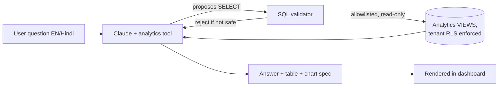

# 05 · AI Integration

AI is woven into the workflow, not bolted on. This doc designs the three capabilities you prioritized — **① NL reports & analytics chat, ② smart quotation & pricing, ③ custom-template document generation** — plus the shared AI infrastructure and the guardrails that keep it safe on multi-tenant financial data. OCR capture and predictive maintenance are designed as **hooks** (§7) for later.

> **Provider:** Anthropic **Claude**, called **server-side only** via the official TypeScript SDK (`@anthropic-ai/sdk`). The API key never reaches the browser. All calls route through our AI gateway (`packages/ai`).

---

## 1. Shared AI infrastructure — `packages/ai` (the gateway)

Every model call goes through one gateway so we get consistent safety, cost control, and auditability:

- **Model routing by task** — pick the cheapest model that does the job (see §6). Cheap/simple → Haiku, balanced → Sonnet, hardest reasoning (pricing, complex analytics) → Opus. Uses **adaptive thinking** (`thinking: {type: "adaptive"}`) with an `effort` level tuned per task.
- **Prompt registry + versioning** — prompts live in code, versioned, evaluated. No ad-hoc prompt strings scattered around.
- **Structured output** — where we need machine-usable results (price build-ups, extracted fields, chart specs) the model is constrained to a **Zod/JSON schema** via `output_config.format` / `messages.parse()`, so we get validated objects, not free text to parse.
- **Per-tenant cost metering & rate limits** — every call is tagged with `tenant_id` + `user_id` + feature; tokens and ₹ cost are recorded to an `ai_usage` table. Per-tenant monthly budgets and per-minute rate limits are enforced at the gateway.
- **Prompt caching** — the large, stable context (DB schema for analytics, rate cards, template contracts) is sent behind a `cache_control` breakpoint so repeat calls are ~10× cheaper on that prefix.
- **Redaction & privacy** — secrets stripped before send; only the tenant's own data is ever in a prompt (RLS-scoped retrieval). Anthropic does not train on API data. Optional PII minimization for names/contacts.
- **Audit** — prompt + response + model + tokens + cost logged (tenant-scoped) for every AI action, so anything the AI produced is traceable.
- **Graceful degradation** — if the API is unavailable, AI features show a clear "assistant unavailable" state; the underlying manual workflows still work (AI never blocks core ERP use).

---

## 2. Feature ① — NL reports & analytics chat  ("ask your data")

**Goal:** the owner types (or speaks) a question in **English or Hindi** — *"is mahine ke pending orders jo 30 din se zyada purane hain"*, *"top 5 customers by sales this quarter"*, *"which VMC machine had the most downtime last week?"* — and gets a correct answer, a table, and a chart.

### Approach: guarded tool-calling over safe analytics views (not raw SQL on raw tables)



**Why this design (and not "let the LLM run any SQL"):**
- The model can only call a `run_analytics_query` tool that executes against a **curated set of read-only analytics views** (e.g. `v_orders`, `v_invoices`, `v_machine_utilization`, `v_attendance`) — never raw tables.
- The query runs as a **read-only DB role**, inside the **tenant RLS context** (`SET LOCAL app.current_tenant`), with a **statement timeout** and a **row cap**. So it physically cannot see another tenant, write data, or run an expensive query.
- A **validator** parses the proposed SQL and rejects anything that isn't a single `SELECT` over allowlisted relations/columns (no DDL/DML, no functions outside an allowlist, no cross-tenant reference).
- The model then **summarizes** the result rows in the user's language and returns a **chart spec** (chart type + encodings) that the frontend renders with our chart components. Numbers come from the DB, never invented.

**Model:** `claude-sonnet-5` for question→SQL→summary (fast, cheap enough for interactive use), escalating to `claude-opus-4-8` for genuinely hard multi-step analytics. Schema + few-shot examples are **prompt-cached**. Responses **stream** for snappy UX.

**Surfaces:** a chat panel on the dashboard, plus "explain this chart" / "why did this change?" affordances on report cards. Saved questions become one-click reports.

---

## 3. Feature ② — Smart quotation & pricing

**Goal:** cut quote turnaround and make pricing consistent. When a salesperson starts a quotation, the AI proposes a **priced, itemized build-up** and drafts the quotation prose — the human reviews, edits, and approves.

### Inputs (all tenant-scoped, pulled from the DB)
- Part/enquiry: description or drawing, material grade & size/weight, quantity.
- Machining plan: operations (turning / VMC / CNC / EDM / grinding …) with estimated **setup + cycle times** — AI can *propose* the operation list & times from the drawing/description; the planner corrects them.
- **Rate card:** machine ₹/hour, labour, material ₹/kg, tooling/consumables, overhead %, target margin % (from `tenant_settings`).
- **History:** last N quotes/orders for this customer and similar parts (for sanity-checking and "you quoted ₹X last time").

### Output (structured, auditable)
A validated object (Zod schema) — not free text — so it's editable and traceable:
```
{
  lineItems: [{ desc, qty, uom, materialCost, machiningCost, toolingCost, unitPrice }],
  costBreakup: { material, machining, tooling, overhead, margin, total },
  assumptions: [ "...", "..." ],       // e.g. cycle-time basis, scrap %
  draftTerms: "delivery, payment, validity ...",   // EN + Hindi
  flags: [ "20% below your last quote for this part" ]
}
```

**The math is deterministic in code** (`packages/gst` + a pricing module); the AI proposes operation lists, time estimates, prose, and anomaly flags. This keeps prices defensible: a human sees exactly how the number was built and can override any cell. Model: `claude-opus-4-8` (pricing is high-value and reasoning-heavy) with structured output; retrieval of history + rate card is prompt-cached per tenant.

*Enhancement (phase 2):* embeddings over past parts for "find similar jobs we've quoted" → even better time/price priors.

---

## 4. Feature ③ — Custom-template document generation  ⭐ (your explicit ask)

**Goal:** generate **Quotation, Proforma Invoice, and GST Bill (Tax Invoice)** as polished PDFs from **the tenant's own custom template** — MS Enterprises' exact letterhead, columns, terms, bank details, signature block.

This is primarily the **deterministic template engine** (see `01-architecture.md` §9); AI plays two **bounded** roles:

### 4a. Template authoring assistant (one-time setup per tenant)
Upload your **existing** quotation/invoice (PDF or photo). The AI (Claude vision via the Files API) reads the layout and **generates an editable HTML template** wired to our document data contract — header/logo placement, column set, terms text, footer, bank details. You tweak it in a template editor. Result: your documents look exactly like today, but now auto-filled and GST-correct. You can keep several templates and pick per document.

### 4b. Free-text drafting inside the document
The AI drafts/polishes only the **prose** fields — scope of work, item descriptions, cover note, terms & conditions, payment terms — in **English or Hindi**, matching your house style.

### Hard rule: AI never computes the legal numbers
```
 Numbers (taxable value, CGST/SGST/IGST, totals, HSN/SAC, invoice no.)  ──► packages/gst  (deterministic)
 Layout (your custom template)                                          ──► HTML template + Playwright → PDF
 Prose (scope, terms, notes, descriptions)                             ──► Claude (draft; human-approved)
```
The template only *presents* values computed by `packages/gst`. This is non-negotiable for GST/e-invoice correctness — an LLM must never produce a tax figure on a legal document. Output PDFs are stored (versioned) in MinIO and attached to the source record; shareable via signed link / WhatsApp / email.

---

## 5. Cross-cutting guardrails

- **Human-in-the-loop** on anything financial/outward: AI *drafts*, a person *approves*. Quotes, invoices, and outbound documents never auto-send.
- **Tenant isolation** end-to-end: retrieval is RLS-scoped; analytics runs as a read-only role in the tenant context; prompts contain only that tenant's data.
- **Determinism where it's legally required:** all tax math, numbering, and totals are code, not AI.
- **Cost control:** model routing (Haiku/Sonnet/Opus), prompt caching on stable context, the **Batch API** (50% cheaper) for nightly report/summary generation, per-tenant budgets + alerts.
- **Evaluation:** a small eval set per feature (question→SQL correctness, price build-up sanity, extraction accuracy) run in CI before prompt/model changes ship.
- **Latency/UX:** stream responses; show the assistant "thinking"; every AI result is editable.

---

## 6. Model selection & cost

Exact model IDs and list prices (per 1M tokens):

| Task | Model | ID | Input / Output | Why |
|---|---|---|---|---|
| NL analytics (question→SQL→summary) | Claude Sonnet 5 | `claude-sonnet-5` | $3 / $15 (intro $2/$10 to 2026‑08‑31) | Fast, cheap enough for interactive chat |
| Hard analytics / multi-step | Claude Opus 4.8 | `claude-opus-4-8` | $5 / $25 | Deepest reasoning when needed |
| Smart quotation & pricing | Claude Opus 4.8 | `claude-opus-4-8` | $5 / $25 | High-value, reasoning-heavy; structured output |
| Document prose drafting | Claude Sonnet 5 | `claude-sonnet-5` | $3 / $15 | Good bilingual writing, low cost |
| Template extraction (vision) | Claude Opus 4.8 | `claude-opus-4-8` | $5 / $25 | Vision + layout reasoning (one-time per template) |
| Classification / tagging / short tasks | Claude Haiku 4.5 | `claude-haiku-4-5` | $1 / $5 | Cheapest, fast |

Real cost is kept low by **prompt caching** (stable schema/rate-card/template context served at ~0.1× after first call) and **batching** offline work. A typical analytics question or quote draft costs a few US cents.

---

## 7. Designed-for-later hooks (not in core build)

The data model and interfaces are built so these drop in without rework:

- **OCR document capture** — photograph a supplier invoice / PO / delivery challan → Claude vision (Files API) extracts line items → structured object → pre-fills a GRN / purchase entry for human confirmation. (Same structured-output + human-approve pattern as §4a.)
- **Predictive maintenance & anomaly alerts** — machine run/downtime logs and attendance/production series feed a metrics job; anomalies and "machine likely to need service" / "order at risk of running late" surface as notifications. (Mostly statistical + optional LLM explanation — not a core LLM feature.)
- **Lead scoring**, **WhatsApp assistant** (ask analytics / send quotes over WhatsApp), and **semantic search** over dies/parts/customers (embeddings) are natural follow-ons.

---

## 8. Where AI shows up in the UI (summary)

| Surface | Feature |
|---|---|
| Dashboard chat panel | ① Ask-your-data analytics (EN/Hindi) |
| Report/chart cards | ① "Explain / why did this change?" |
| Quotation editor | ② Suggested price build-up + drafted terms + anomaly flags |
| Settings → Documents | ③ Template authoring assistant (upload → editable template) |
| Quotation / Proforma / Invoice editor | ③ Draft prose fields (scope, terms, notes) |
| Purchase / GRN (phase 2) | OCR capture |
| Notifications (phase 2) | Predictive & delay-risk alerts |

---

## 9. Agentic document generation & editing (built 2026-09-02)

The assistant can build and edit quotations, tax invoices and sales orders end-to-end, with the human-in-the-loop card as the only write path.

**Reading.** `get_document {type, id | number}` — instant, read-only. Returns the header, customer, the lines numbered exactly as printed (S.No, part, custom-column values by name, tooling flag), totals, terms/notes and lock state. Number lookup is `ILIKE` on a fragment (`"0003"`, `"26-27/0012"`); ambiguous matches are returned as candidates so the model asks instead of guessing.

**Editing.** `update_quotation / update_invoice / update_order` take `edits` — line-level ops resolved server-side against the *current* lines (`apps/web/src/lib/doc-edits.ts`, pure, tested with `pnpm --filter @ms/web test`):

| op | what it does |
|---|---|
| `update` | change any field of one line (rate, qty, description, GST %, part, column values) |
| `add` / `remove` / `move` | insert (into a part or after a line), delete, reorder |
| `adjust_rates` | `percent` or `amount` on `lines`, a part (`groupLabel`) or all; optional `roundTo` (e.g. ₹100) |
| `set_gst` | set a GST rate on a scope |
| `set_group` / `rename_group` | regroup lines under a part / rename a part |
| `set_column` / `rename_column` / `remove_column` | custom descriptive columns |

Line numbers in a batch always mean the document *before* the batch, so the model plans every edit from one `get_document` read. The staged payload is the fully resolved document (so the card can show and edit the whole thing), and the card carries a change list (“Line 3 “Blanking die”: rate ₹30,000 → ₹32,000”). A full `items` array is still accepted for rebuild-from-scratch; it's diffed against the current lines for the same change list. Limits: 60 lines, 12 custom columns.

**Repeat jobs.** `duplicate_quotation {quotationId, customerId?, edits?}` copies lines/parts/columns/terms into a fresh numbered draft (optionally for another customer), with edits applied to the copy.

**Card UX.** Every document proposal renders a grouped preview (parts, subtotals, column chips, totals computed with the same `computeGst`) and a **Review & edit** button that opens the full-width line-items editor the forms use (portal modal), with live totals. Edits go back through `buildStage` (zod + business checks) before execution. The panel can be widened, and the thread survives reloads (sessionStorage).

---

## 10. Complex documents — parts, items and specs (built 2026-09-03)

Real job-shop quotes are not flat lists: one enquiry covers several **parts**, each part needs several **items** (blanking die, bending die, piercing die…), and each item carries its own specs.

**The shape.** One line per item. `group_label` names the part (consecutive lines print under one heading with a subtotal); `group_note` (migration 0008) holds detail about the *part* — drawing no., component, material, sheet thickness — and is stored on every line of that part so it survives reordering. Per-item specs live in `attributes`, keyed by the document's `column_defs`.

**Making many fields printable.** `ColumnDef.display` decides where a field appears: `'column'` (its own table column) or `'spec'` (under the item description as `Material: D2 · Hardness: 58–60 HRC`). Omitted means automatic: while ≤2 fields are undecided they stay columns — so existing documents look unchanged — and a third moves them all under the item, which keeps A4 readable with 6+ specs. One rule, in `packages/core/src/documents.ts` (`splitColumns` / `itemSpecs` / `formatSpecs` / `groupRuns`), used by the PDF, the detail table, the line editor and the AI's confirmation card, so all four always agree. Caps: 60 lines, 16 fields.

**AI.** `create_*` items take `groupLabel`, `groupNote` and `attributes` ({name,value} pairs). Editing adds ops to the line-level `edits` set: `set_group_note` (part detail), `set_specs` (the same spec values across a part or a set of lines — "every die of part 41928 is D2, 58–60 HRC"), and `set_column_display`. A line joining a part inherits that part's detail; leaving it drops it. `get_document` returns the parts with their detail and subtotals, each item's specs by name, and how each field prints. In-form drafting (`quote-draft.ts` → `lib/quote-draft-rows.ts`) produces the same structure from a typed enquiry.
