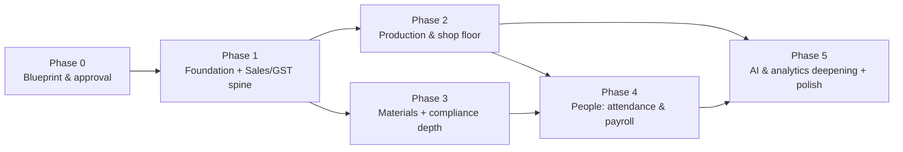

# 06 · Build Roadmap & Phasing

How we go from blueprint → working ERP, in **vertical slices** that each ship something usable. AI is **threaded into the phases** where it adds value (custom-template documents and smart quoting in Phase 1), not saved for the end.

> **Timeline caveat:** the week ranges below are **indicative for a small focused team (~2–3 engineers)**. They compress with more people and stretch with fewer — we firm them up against your team + velocity after you approve the design. Nothing here is a commitment yet.

---

## Phase map

| Phase | Theme | Indicative | Ships |
|---|---|---|---|
| **0** | Blueprint & approval | *(now)* | These 7 docs + visual artifact; confirmed assumptions |
| **1** | Foundation + Sales/GST spine | ~6–9 wks | Enquiry → quote → order → **GST invoice on your custom template**; smart quoting |
| **2** | Production & shop floor | ~6–8 wks | Job cards, machine tracking, dies, mobile operator view |
| **3** | Materials + compliance depth | ~4–6 wks | Purchase→GRN, inventory, e-invoice/e-way, job-work challans/ITC-04 |
| **4** | People | ~4–6 wks | Attendance → payroll (OT, PF/ESI, registers) |
| **5** | AI & analytics deepening + polish | ~3–5 wks | NL analytics at full depth, predictive/anomaly hooks, hardening |

Phases 2 and 3 can run **partly in parallel** after Phase 1 (different subsystems). Total to a full-featured v1: roughly **~5–7 months** for a small team — but you have a **usable, demoable product at the end of Phase 1**.

---

## Phase 0 — Blueprint & approval  *(current)*
- ✅ Vision, architecture, data model, modules+RBAC, wireframes, AI design, roadmap.
- ✅ Visual review artifact.
- ⏳ **You:** confirm the open assumptions (`00` §9 / `02` §14) — job-work vs own-manufacture mix, GST/e-invoice applicability, inventory & payroll depth, EN+Hindi, migration data.
- **Exit:** you approve the design (and any changes), I start building.

## Phase 1 — Foundation + Sales/GST spine  *(the usable core)*
**Platform:** monorepo scaffold; Docker (Postgres + Redis + MinIO); CI; **multi-tenancy + Postgres RLS**; Auth.js + RBAC; company/branch/users/roles; tenant settings; versioned **parameter tables** (GST rates, thresholds) + **document numbering**.
**Masters:** customers (+ addresses/GSTIN), parts, HSN/SAC, UQC.
**CRM & Sales:** lead pipeline, customers, **quotation** (with tooling/NRE split), proforma, **order book** (with the `material_ownership` branch).
**Finance:** **GST tax invoice** (auto CGST/SGST ↔ IGST from buyer state, HSN/SAC, amount-in-words), delivery challan, **custom-template PDF engine** (Playwright) — *your explicit ask*.
**AI (threaded in):** ✨ **smart quotation & pricing**, ✨ **custom-template authoring** (upload your invoice → editable template), ✨ document prose drafting; ✨ **NL analytics v1** once sales data exists.
**UX:** app shell, bilingual, dashboard v1.
- **Exit / demo:** MS Enterprises runs **enquiry → quote → order → GST invoice on their own letterhead**, with AI-assisted pricing — feature parity with the reference on sales/GST, and ahead on templates + AI.

## Phase 2 — Production & shop floor  *(the differentiator)*
- **Machines** master + **event-based utilization log** + **live board** (Socket.IO realtime) + downtime Pareto/OEE-lite.
- **Routing master** + **Job traveller** (`job` / `job_operation`) with **sequence gates** (rough→harden→grind→assembly→trial→FAI→dispatch).
- **Die management:** master, lifecycle/hit-life, maintenance schedule + history.
- **Quality:** in-process/final/FAI inspection + dimensional records + NCR/rework.
- **Mobile operator view** (start/stop op, log qty & downtime).
- **Job-costing:** planned vs actual time/machine-hours → margin.
- **Exit:** real-time shop-floor visibility on desktop **and phone** — the depth generic ERPs (Tally/Zoho) don't have.

## Phase 3 — Materials + compliance depth
- Suppliers; **purchase indent → PO → GRN** (against PO *or* customer challan).
- **Inventory / stock ledger** (valued own stock **+** customer-owned qty-only memo ledger); **tooling crib** + transactions; consumables.
- **e-Invoice (IRN + signed QR)** via a GSP; **e-Way Bill**; **job-work challans + Sec-143 aging + ITC-04** data.
- **Exit:** closed-loop materials and full India compliance (the parts most ERPs get wrong for a job-shop).

## Phase 4 — People
- Employees; **attendance** (biometric import, regularization workflow, shifts); OT auto-calc (2× beyond 9h/day, 48h/wk).
- **Payroll:** components, EPF/ESI/gratuity/bonus, LWP, advances; **wage register + muster roll**; headcount-driven compliance flags (Haryana 20-worker factory threshold, no PT).
- **Exit:** attendance → payroll → statutory registers, end to end.

## Phase 5 — AI & analytics deepening + polish
- **NL analytics** at full depth (more views, saved reports, "explain this chart"); reports/analytics dashboards per role.
- **Predictive & anomaly hooks activated** (delay-risk, machine-maintenance likelihood, attendance/production anomalies); **OCR capture** hook for supplier invoices.
- Internal **chat**, notification rules, performance hardening, security review, backups/restore drill, docs.
- **Exit:** the "AI-native" story fully realized; production-grade.

---

## Cross-phase engineering practices
- **Every phase:** typecheck + lint + unit + e2e green in CI; RLS tested; seed/demo data; short eval set for any AI feature.
- **Migrations** are forward-only and reviewed; RLS policies live in migrations.
- **Feature-flagged** modules per tenant (so we can dark-launch and MS Enterprises adopts progressively).
- **Demo checkpoint** at the end of each phase — you see it working, we adjust before moving on.

## What I need from you to start Phase 1
1. Sign-off on this blueprint (or a change list).
2. Answers to the open assumptions (`00` §9).
3. Your current **quotation / invoice formats** (PDF/photo) — so the template engine matches them exactly.
4. A short sample of real data (a few customers, parts, dies, an employee list) for realistic seed/testing.
5. Confirmation of hosting target (a server you control, or a cloud VM) for the first deploy.
